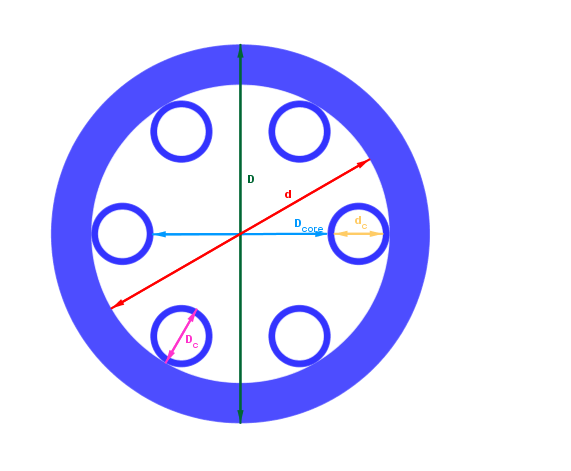

# Tubular Anti-resonant Hollow-core fibers drawing simulation

### Description

This application allows to compute the drawing parameters to realize a tubular hollow-core optical fiber. The method used in this software is that described in the paper of Jasion *et al.* [[1]](#1) with two minor corrections:

1. Equation 3 has been modified as follow to take into account the fact that the black body radiation is a surface phenomenom and not a volume phenomenom:
   

2. The viscosity model is based on a more recent paper [[2]](#2)

The tab "Direct computation" computes the evolution of all the structural fiber parameters during the drawing process with the input chosen by the user.

The tab "Optimization" computes the pressures and the furnace temperature that allow to obtain a target fiber from a given preform.

### Installation

The application has been designed with MATLAB R2019a and its optimization toolbox. It can be launched directly from the source code: the main file is *HARF_drawing.mlapp*. If you do not have this matlab version/toolbox, an installation file for windows 10 is provided in the release. 

### Citation
If you use this software in a publication, you can cite it as follow:
O. Vanvincq, "Harf-drawing" (2019), https://doi.org/10.5281/zenodo.3582197

### User manual

All the distances used in the program are shown in the picture below.

List of the parameters used in the program :

- *Pcore* : core pressure 
- *Pcap* : overpressure between capillaries and core
- *Feed speed* : speed of the preform 
- *Vf* : drawing speed
- *L* : computing length. must be greater than the furnace length.
- *D0* and *Df* : value of *D* at *z=0* (preform) and *z=L* (fiber)
- *Dc0* and *Dcf* : value of *Dc* at *z=0* (preform) and *z=L* (fiber)
- *d0* and *df* : value of *d* at *z=0* (preform) and *z=L* (fiber)
- *dc0* and *dcf* : value of *dc* at *z=0* (preform) and *z=L* (fiber)
- *tf* : fiber capillaries thickness, *tf=(Dcf-dcf)/2*
- *Dcore* : fiber core diameter
- *Draw tension* : draw tension at *z=L*
- *Tmax* : maximum temperature of the furnace. At *z=0*, the preform temperature is assumed to be equal to the furnace temperature decreased by 500°C.
- *Furnace length* : must be lower than *L*. The température outside the furnace is fixed to 20°C.
- *Furnace temperature profile* : function of *z* that described the evolution of the normalized furnace temperature (*T/Tmax*) between *z=0* and the *furnace length*
- *Max(Rc/Rcontact)* : if this value is greater than 1, the capillaries are in contact and the fiber is deformed.

### References

<a id="1">[1]</a> [Gregory T. Jasion, John R. Hayes, Natalie V. Wheeler, Yong Chen, Thomas D. Bradley, David J. Richardson, and Francesco Poletti "Fabrication of tubular anti-resonant hollow core fibers : modelling, draw dynamics and process optimization", Opt. Express, 27(15) :20567-20582, 2019.](https://doi.org/10.1364/OE.27.020567)

<a id="1">[2]</a> [A. Kondratiev and A.V. Khvan "Analysis of viscosity equations relevant to silicate melts and glasses",Journal of Non-Crystalline Solids, 432 :366-383, 2016.](https://doi.org/10.1016/j.jnoncrysol.2015.10.033)
